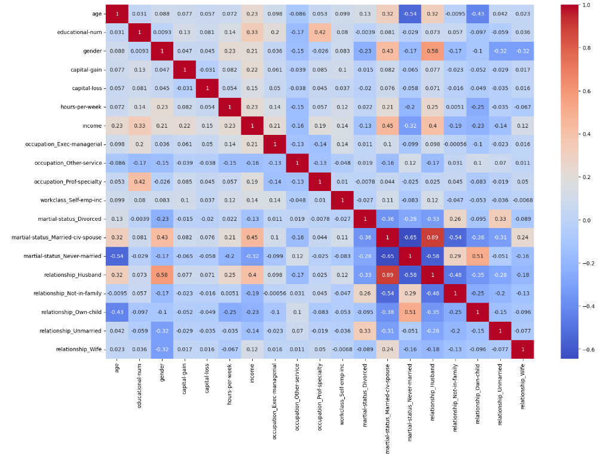

# Data Analysis and Machine Learning Project

## Overview
This project involves comprehensive data analysis and machine learning techniques, focusing on a dataset related to income. Key skills demonstrated include data preprocessing, visualization, model training, evaluation, and hyperparameter tuning.

## Skills Demonstrated

### Data Preprocessing
- **Pandas:** Utilized for data manipulation and analysis.
  - Reading CSV files into a DataFrame.
  - Value counts and handling of categorical data.
  - Dropping unnecessary columns.
  - Transforming categorical variables into dummy/indicator variables.

### Data Visualization
- **Seaborn and Matplotlib:** Used for creating informative visualizations.
  - Generating heatmaps for correlation analysis.
  

### Model Training and Evaluation
- **RandomForestClassifier:**
  - Training a model on preprocessed data.
  - Evaluating model accuracy on a test dataset.
  - Extracting and analyzing feature importances.

### Hyperparameter Tuning
- **GridSearchCV:**
  - Performing grid search to find optimal hyperparameters for RandomForestClassifier.
  - Retraining the model with the best parameters.
  - Assessing the performance of the optimized model.

## File Description
- `main.ipynb`: Jupyter Notebook containing the entire workflow, from data preprocessing to model evaluation.

## Libraries Used
- Pandas
- Seaborn
- Matplotlib
- Scikit-learn

---